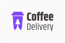
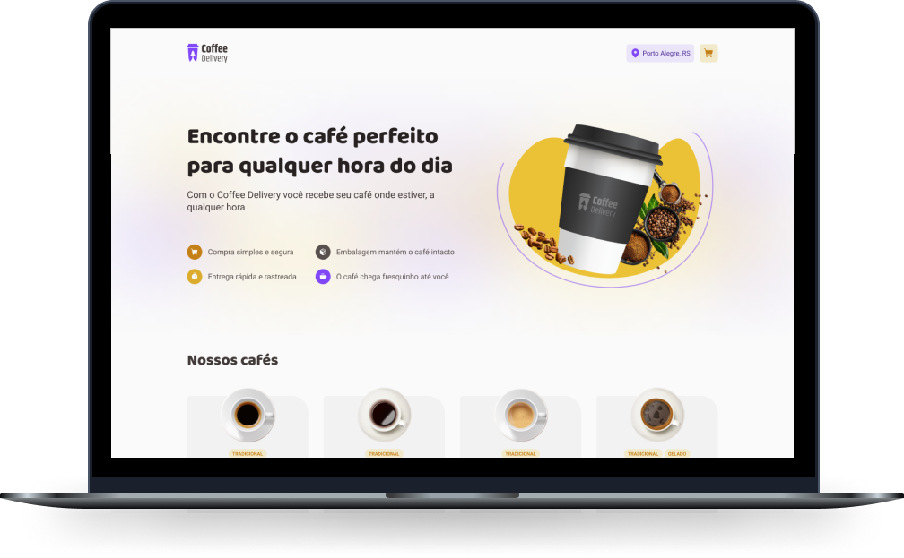

<h1 align="center">
  
</h1>

<p align="center">
  <a href="#-tecnologias">Tecnologias</a>&nbsp;&nbsp;&nbsp;|&nbsp;&nbsp;&nbsp;
  <a href="#-projeto">Projeto</a>&nbsp;&nbsp;&nbsp;|&nbsp;&nbsp;&nbsp;
  <a href="#-layout">Layout</a>&nbsp;&nbsp;&nbsp;|&nbsp;&nbsp;&nbsp;
  <a href="#-execute-o-projeto-localmente">Executar projeto</a>&nbsp;&nbsp;&nbsp;|&nbsp;&nbsp;&nbsp;
  <a href="#memo-licença">Licença</a>
</p>

<p align="center">
  
</p>

<br>

<p align="center">
  
</p>

## 🚀 Tecnologias

Esse projeto foi desenvolvido com as seguintes tecnologias:

- [React](https://react.dev/)
- [Typescript](https://www.typescriptlang.org/)
- [Vite](https://vitejs.dev/)

## 💻 Projeto

- O Coffee Delivery é uma aplicação para gerenciar um carrinho de compras de uma cafeteria fictícia.
  
- Este projeto surgiu como um desafio na trilha React.js 2022 do Ignite da Rocketseat.

## 🔖 Layout

Você pode visualizar o layout do projeto através [desse link](https://www.figma.com/file/5yT9ZzZmRQRS4yivGGB3pl/Coffee-Delivery/duplicate). É necessário ter conta no [Figma](https://figma.com) para acessá-lo.

## 💻 Execute o projeto localmente

```sh
# Clone o repositório do projeto
git clone HTTPS-or-SSH-URL

# Acesse a pasta do projeto
cd ignite-coffee-delivery

# Instale as dependências
npm install
# OU
yarn

# Inicie o projeto em modo de desenvolvimento
npm run dev
# OU
yarn dev
```
---

## :memo: Licença

Esse projeto está sob a licença MIT.


<p align="right"> 
  <a href="https://www.linkedin.com/in/breno-dias-holanda/" target="_blank">
    
  </a>
</p>
